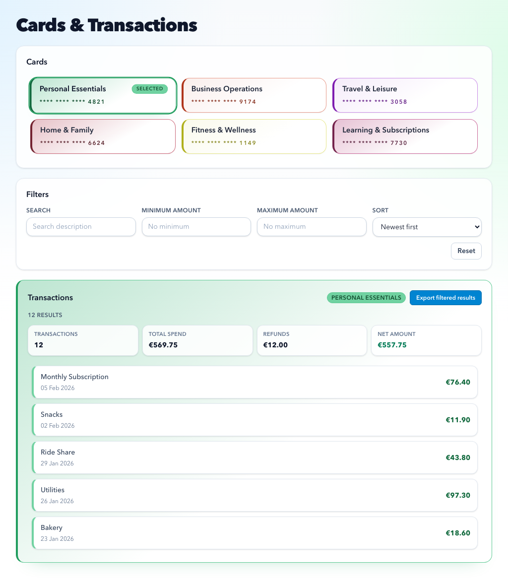

# Cards & Transactions Overview (Frontend)

React + TypeScript application for rendering mocked cards and transactions, with client-side filtering, theming, accessibility support, and automated testing.

## Demo

- https://drive.google.com/drive/u/0/folders/1XuJ_a4f3QA15ve9qf4TUXzsXY0oajS7b

## Screenshot



## Tech Stack

- Framework: React 19 (function components + hooks)
- Language: TypeScript
- Styling: Tailwind utility classes + feature CSS (`src/features/cardsOverview/cardsOverview.css`)
- Data source: static JSON (`public/data`) accessed through API adapters
- Testing: Vitest + Testing Library + Playwright (including visual snapshots)

## Why This Architecture

- API-first frontend shape: static JSON is accessed through `api/cardsApi.ts`, so swapping to real HTTP endpoints is straightforward ([Design decision D2](./docs/implementation/design-decisions.md#d2-stable-data-contract-boundary)).
- Feature-first module: `src/features/cardsOverview` keeps domain logic cohesive and discoverable ([Design decision D1](./docs/implementation/design-decisions.md#d1-feature-oriented-modular-architecture)).
- Shared UI primitives: `src/shared/ui` avoids duplicating behavior and keeps interactions consistent ([Design decision D1](./docs/implementation/design-decisions.md#d1-feature-oriented-modular-architecture)).
- Mobile-first and accessible by design: responsive section composition, keyboard support, and live announcements are built into core flows ([Design decision D7](./docs/implementation/design-decisions.md#d7-accessibility-and-responsiveness-as-architecture-constraints)).
- Layered testing strategy: unit, integration, e2e, and visual tests provide balanced confidence ([Design decision D7](./docs/implementation/design-decisions.md#d7-accessibility-and-responsiveness-as-architecture-constraints)).

## Folder Overview

- `src/features/cardsOverview/`
  - `api/` API adapter layer
  - `hooks/` state and filter orchestration
  - `components/` page/section/domain components
  - `types/` feature type definitions
  - `utils/` pure helpers and formatters
- `src/shared/ui/` reusable UI primitives and patterns
- `src/shared/hooks/` shared composables
- `src/shared/utils/` shared utilities
- `tests/e2e/` Playwright flows + visual regression tests
- `docs/implementation/` design/testing/performance/a11y/responsiveness docs

## Data Endpoints

The app intentionally uses static, mocked endpoints:

- `GET /data/cards.json`
- `GET /data/transactions.json`

## Implemented Features

- Card overview with selectable cards and deterministic per-card theming.
- Transactions view linked to the selected card, including themed styling consistency.
- Transaction filtering by search text, minimum amount, maximum amount, and sort order.
- Debounced filter application (`250ms`) for smoother typing and lower request churn.
- Active filter chips with per-chip removal and `Clear all`.
- Transaction summary tiles (count, total spend, credits/refunds, net amount).
- CSV export for the currently filtered transaction result set.
- Robust async state handling with loading, error, and cancelable request behavior.
- Accessible interactions: keyboard support, semantic structure, and screen-reader live announcements for loading/result changes.
- Responsive mobile-first layout with stable containers and scrollable dense lists.

## Implemented Tests

- Unit tests (`Vitest`):
  - utility logic (`helpers`, `announcements`, `theme`, `transaction export`, `filter form helpers`),
  - hook behavior (`useTransactionFilterForm`).
- Integration tests (`Vitest` + Testing Library):
  - feature-level behavior in `CardsOverview.integration.test.tsx` (loading/error states, card switching, filtering, chips, export button states).
- E2E tests (`Playwright`):
  - core user flows in `tests/e2e/cards-overview.spec.ts` (real browser interactions).
- Visual regression tests (`Playwright` screenshots):
  - key layout states in `tests/e2e/cards-overview.visual.spec.ts`.
- App-level smoke:
  - baseline render test in `src/App.test.tsx`.

## Project Run Guide

### Prerequisites

- Node.js `>= 20`
- npm `>= 10`

### Install

```bash
npm install
```

### Run Locally

```bash
npm run dev
```

Open the app at: `http://localhost:5173` (or the URL shown by Vite).

### Build

```bash
npm run build
```

### Test Commands

```bash
npm run test:unit
npm run test:integration
npm run test:run
npm run test:e2e -- tests/e2e/cards-overview.spec.ts
npm run test:e2e -- tests/e2e/cards-overview.visual.spec.ts
npm run test:e2e:ui
```

### Update Visual Snapshots

```bash
npm run test:e2e -- tests/e2e/cards-overview.visual.spec.ts --update-snapshots
```

## Assumptions and Tradeoffs

- API boundary first: even with local JSON data, the app goes through an API adapter to keep a stable contract for future backend migration ([Design decision D2](./docs/implementation/design-decisions.md#d2-stable-data-contract-boundary)).
  - Tradeoff: slightly more code for this assignment size.
- Client-side filtering/sorting: current filtering is applied in the frontend for fast iteration and simpler local setup ([Design decision D5](./docs/implementation/design-decisions.md#d5-debounced-filter-interaction-model)).
  - Tradeoff: this model is not ideal for large datasets.
- Debounced filter model: text and amount inputs use draft state plus a `250ms` debounce before applying ([Design decision D5](./docs/implementation/design-decisions.md#d5-debounced-filter-interaction-model)).
  - Tradeoff: smoother typing, but result updates are not instant.
- Async safety and UX stability: requests are cancelable and the UI keeps current rows visible while refresh is in progress ([Design decision D6](./docs/implementation/design-decisions.md#d6-async-safety-and-perceived-performance-strategy)).
  - Tradeoff: users can briefly see stale data until the next response arrives.
- Client-side theming: card/transaction colors are generated deterministically from card identity to keep visual mapping stable ([Design decision D4](./docs/implementation/design-decisions.md#d4-deterministic-card-theming)).
  - Tradeoff: near-color collisions are still possible at higher card counts.
- Visual test scope: visual snapshots are focused on key states only ([Design decision D7](./docs/implementation/design-decisions.md#d7-accessibility-and-responsiveness-as-architecture-constraints)).
  - Tradeoff: lower coverage of rare layout combinations.

## What I Would Improve With More Time

- Move filtering/sorting/pagination to the backend for large datasets and predictable latency.
- Move theming to backend-owned design tokens so each card has one canonical color identity across clients and the frontend no longer owns color-generation logic.
- Add URL-synced filter state for shareable views and better back/forward navigation.
- Extend filtering with date range + transaction type + saved filter presets.
- Add explicit filter validation (invalid numeric input, min/max conflicts) with inline and screen-reader-friendly error messaging.
- Improve export for larger datasets (server-generated CSV, background job, status feedback).
- Add richer transaction insights (categories, recurring detection, spend trends).
- Harden reliability with structured error taxonomy, retries/backoff, and request telemetry.
- Add CI quality gates for performance and visual regressions (budget thresholds + snapshot policy).

## Implementation Documentation

Detailed design and engineering notes:

- [Implementation index](./docs/implementation/README.md)
- [Design decisions](./docs/implementation/design-decisions.md)
- [Testing strategy](./docs/implementation/testing-strategy.md)
- [Performance considerations](./docs/implementation/performance.md)
- [Accessibility](./docs/implementation/accessibility.md)
- [Responsiveness](./docs/implementation/responsiveness.md)
